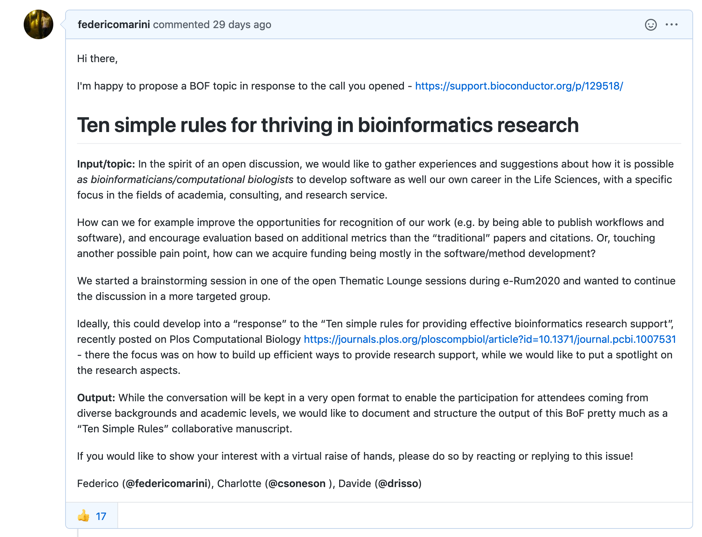
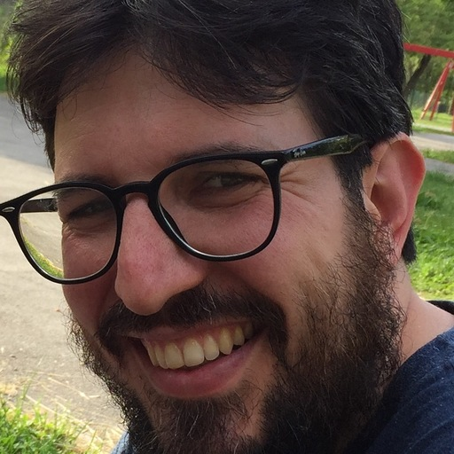

layout: true
  
<div class="my-footer">
<span>
&emsp;&emsp;&emsp;&emsp;&emsp;&emsp;&emsp;&emsp;&emsp;&emsp;
&emsp;&emsp;&emsp;&emsp;&emsp;&emsp;&emsp;&emsp;&emsp;&emsp;
&emsp;&emsp;&emsp;&emsp;&emsp;&emsp;&emsp;&emsp;&emsp;&emsp;
<!-- &emsp;&emsp;&emsp;&emsp;&emsp;&emsp;&emsp;&emsp;&emsp;&emsp; -->
&emsp;&emsp;&emsp;&emsp;&emsp;
<!-- <a href="http://bit.ly/genetonic2019"><code>http://bit.ly/genetonic2019</code></a> -->
<a href="https://federicomarini.github.io/eurobioc2020bof"><code>https://federicomarini.github.io/eurobioc2020bof</code></a>
</span>
</div>

---

class: center

```{r setup, include=FALSE}
options(htmltools.dir.version = FALSE)
knitr::opts_chunk$set(
  eval = FALSE,
  message = FALSE,
  echo = FALSE,
  warnings = FALSE,
  fig.align = "center"
)
```

```{r}
library("tweetrmd")
```

# About this session

<p align="center">

</p>

[`https://github.com/Bioconductor/BioC2020/issues/105`](https://github.com/Bioconductor/BioC2020/issues/105)

---

class: center

# Bioinformatics == research

```{r eval=TRUE}
tweetrmd::include_tweet(
  tweet_url = "https://twitter.com/wetlabsucks/status/1311610339348434946"
  )
```

---

class: center

# Bioinformatics == research

... and not just support/collaborations!

"Ten simple rules for providing effective bioinformatics research support", recently posted on Plos Computational Biology https://journals.plos.org/ploscompbiol/article?id=10.1371/journal.pcbi.1007531

--

We've all been there, and we can share our tips to deal with this struggle!

--

We want to develop both software **and** careers (our own, and these of our trainees/colleagues) 

---

class: center

# About us

<table>
<tr>
<td width="33%"><a href="https://federicomarini.github.io">
</a></td>
<td width="33%"><a href="https://csoneson.github.io">
</a></td>
<td width="33%"><a href="https://drisso.github.io">
</a></td>
</tr>

<tr>
<td align='center' width="33%">Federico</td>
<td align='center' width="33%">Charlotte</td>
<td align='center' width="33%">Davide</td>
</tr>

<tr>
<td align='center' width="33%"><code>`r icon::fa('twitter')`@FedeBioinfo</code></td>
<td align='center' width="33%"><code>`r icon::fa('twitter')`@CSoneson</code></td>
<td align='center' width="33%"><code>`r icon::fa('twitter')`@drisso1893</code></td>
</tr>
</table>

---

class: center

# How this will work

Start here: <i class="fab fa-google-drive"></i> [`https://drive.google.com/drive/folders/1y6pkCBY6yXP4bryqIN3f9ZH32oQ8J7BA?usp=sharing`](https://drive.google.com/drive/folders/1y6pkCBY6yXP4bryqIN3f9ZH32oQ8J7BA?usp=sharing)

--

<i class="fa fa-lightbulb"></i> We have collected some initial ideas, mostly based on our previous experiences + Bioc2020 BoF

<i class="fas fa-clipboard"></i><i class="fab fa-google-drive"></i> We are going to take notes in a [GDoc](https://docs.google.com/document/d/1ybYpu4XO_WdGhUYYkmxabBjpkyMoGQWCWdB-PhsIoMk/edit?usp=sharing) (drop some details on your contact info - email/twitter)

<i class="fas fa-users"></i><i class="fas fa-microphone"></i> We are more than happy to have you grab the mic!

<i class="fab fa-slack"></i><i class="fas fa-comment-dots"></i> We set up a channel on Slack to continue the discussion - check out [#bioc2020-bof-10sr](https://join.slack.com/share/zt-ga8fmolw-kay~yiF~mZgz6pzz6R6lBw) in the [Bioconductor](https://community-bioc.slack.com) Slack workspace

<i class="far fa-newspaper"></i><i class="fab fa-github"></i>  We would like to come up with a collaborative manuscript, in a format inspired by the "Ten Simple Rules" series - check out [`https://github.com/drisso/ThrivingInBioinformatics`](https://github.com/drisso/ThrivingInBioinformatics)

<i class="fas fa-pencil-alt"></i><i class="fas fa-chalkboard"></i> We will try to sketch the 10 "directions" in
this set of Google Slides

<i class="fas fa-forward"></i> Gather thoughts and plan next meeting via Slack (+ Airmeet again?)

